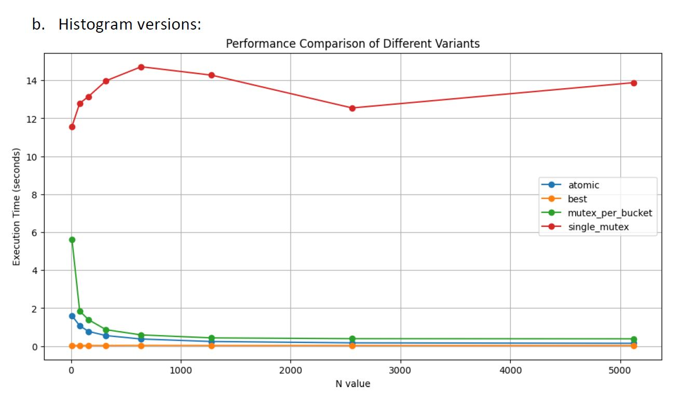

# Histogram Analysis with Parallel Computing

This repository contains a suite of programs for histogram analysis that demonstrate the use of parallel computing techniques in C++. The parallel implementations are derived from a sequential version provided by a parallel computing course and are designed to showcase different synchronization strategies.

## Author

Saleh Elkaza

## Course Project Overview

The original sequential version of the histogram (`histogram.cpp`) was supplied by the course. The parallel versions created from this base include atomic operations, mutexes, and a hybrid approach for thread-safe updates to a shared histogram during large dataset processing.

## Implementations and Usage

The following versions are available in this repository:
- `histogram-atomic.cpp`
- `histogram-best.cpp`
- `histogram-mutex-per-bucket.cpp`
- `histogram-mutex.cpp`
- `histogram.cpp` (Sequential baseline provided by the course)

### Running the Programs

To run any version of the histogram program, compile it using:

```bash
g++ -std=c++11 -pthread -o histogram <version>.cpp
```

And then execute it with appropriate arguments. For example:

```bash
./histogram --num-threads 32 --N 1000 --sample-size 30000000 --print-level 1
```

### Automated Testing

The `run-test.sh` script facilitates automated testing across all versions for different histogram sizes. It measures and logs the performance of each version:

```bash
chmod +x run-test.sh
./run-test.sh
```

This will output the execution times to `performance_for_all_versions_results.csv` for further analysis.

## Performance Comparison



